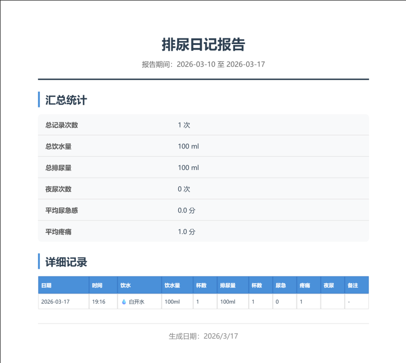

# 排尿日记 - 专业版

一款专业的饮水 - 排尿健康记录应用，帮助用户追踪日常饮水和排尿习惯，为医疗诊断提供数据支持。

## 📸 项目截图

### 程序界面


### PDF 报告模板


## 📋 功能特点

### 核心功能
- **统一记录**：每次记录包含饮水和排尿信息，符合人体生理过程
- **详细数据**：
  - 饮水：种类、容量 (ml)、杯数、饮水后症状
  - 排尿：容量 (ml)、杯数、尿急感 (0-3)、疼痛感 (0-3)、夜尿标记、排尿症状
- **数据统计**：每日汇总统计，包括总饮水量、总排尿量、平均尿急感、平均疼痛等
- **趋势图表**：4 种可视化图表展示健康趋势
- **PDF 导出**：生成专业医疗报告，支持中文
- **数据持久化**：SQLite 数据库本地存储，保护隐私

### 记录字段

| 饮水信息 | 排尿信息 |
|---------|---------|
| 饮水种类（8 种可选） | 排尿量 (ml) |
| 饮水量 (ml) | 排尿杯数 |
| 饮水杯数 | 尿急感 (0-3 分) |
| 饮水后症状 | 排尿疼痛 (0-3 分) |
| | 夜尿标记 |
| | 排尿症状 |
| 备注 | |

## 🛠️ 技术栈

### 前端
- **框架**：Vue 3 + Vite
- **图表**：Chart.js + vue-chartjs
- **PDF 生成**：jsPDF + html2canvas
- **UI**：自定义组件库

### 后端
- **服务器**：Express.js
- **数据库**：SQLite3
- **端口**：前端 9009，后端 9509

## 📦 安装与运行

### 1. 安装依赖
```bash
npm install
```

### 2. 启动后端服务（端口 9509）
```bash
node server.js
```

### 3. 启动前端开发服务器（端口 9009）
```bash
npm run dev
```

### 4. 访问应用
打开浏览器访问：http://localhost:9009

### 5. 局域网访问
- 查看本机 IP：`ipconfig`
- 其他设备访问：`http://你的 IP 地址:9009`

## 🔒 隐私保护

- 所有数据存储在本地 SQLite 数据库
- 无需联网即可使用
- 不上传任何个人信息到云端

## 💡 使用建议

1. **连续记录**：建议连续记录至少 3 天，以便医生更好地诊断
2. **及时记录**：每次饮水排尿后尽快记录，确保数据准确
3. **详细备注**：特殊情况（如外出、运动）可在备注中说明
4. **定期导出**：可将数据导出为 PDF 供医生参考

## 📝 评分说明

### 尿急感评分 (0-3)
- **0 分**：无尿急感
- **1 分**：轻微尿急，可忍受
- **2 分**：中等尿急，需尽快如厕
- **3 分**：强烈尿急，几乎无法控制

### 疼痛评分 (0-3)
- **0 分**：无疼痛
- **1 分**：轻微不适
- **2 分**：中等疼痛
- **3 分**：严重疼痛